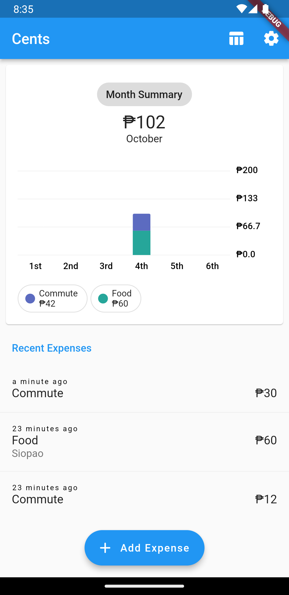

# cents

Expense logging app for Android, written in Flutter. 

## Screenshots

<table>
    <tr>
        <td></img></td>
        <td></img></td>
        <td></img></td>
    </tr>
    <tr>
        <td></img></td>
        <td></img></td>
    </tr>
</table>